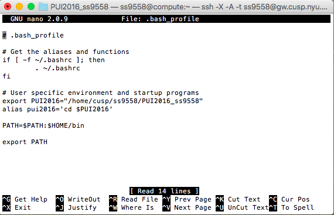
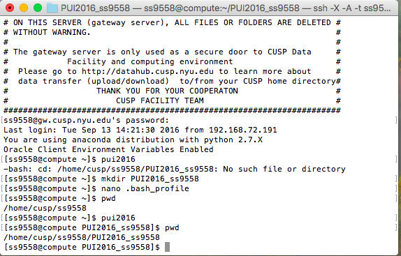

# PUI 2016 HW 1.  

# Assignment 1: Finish the first lab and work with a fork

My neighbor in this assign is cx495. 
 I forked his repo “gitthubtest_cx495” and then cloned it as a local repo. I then made changes to my local copy, adding a line of code. After that, I committed my modified file and pushed the changes. I then requested a merge and accepted my neighbor’s pull request as well.

# Assignment 2: Set up your environment: 

1. I created a local directory named PUI2016_ss9558.
2. I created an environment variable PUI2016 so that typing “echo $PUI2016” returns the full path. 
	
3. I created an alias pui2016 so that typing it takes me to that directory.  
4. Screenshot of my .bashprofile

                      

5. Screenshot of my terminal that shows this series of commands and output

                      
                      
6. I created a new github repo and one on my local machine.
7. I created a directory HW1_ss9558
8. I added a README.md file to describe my homework 1.

